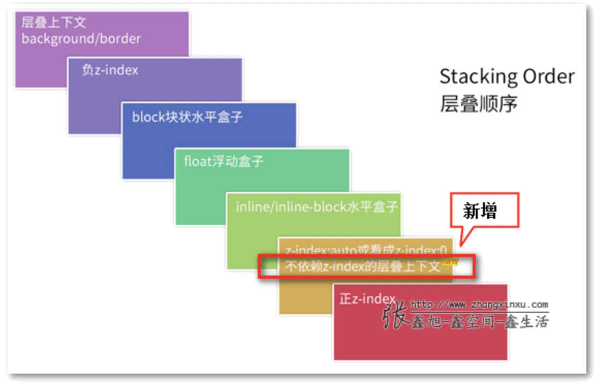

# 层叠上下文

## 层叠规则

## 开启层叠上下文

-   根元素 html
-   position 值为 absolute（绝对定位）或 relative（相对定位）且 z-index 值不为 auto 的元素
-   position 值为 fixed（固定定位）或 sticky（粘滞定位）的元素
-   flex (flex) /grid (grid) 容器的子元素，且 z-index 值不为 auto
-   opacity 属性值小于 1 的元素
-   transform/filter 值不为 none 的元素
-   will-change 值设定了任一属性而该属性在 non-initial 值时会创建层叠上下文的元素
