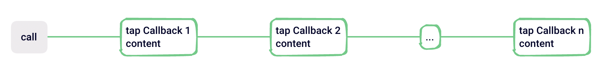
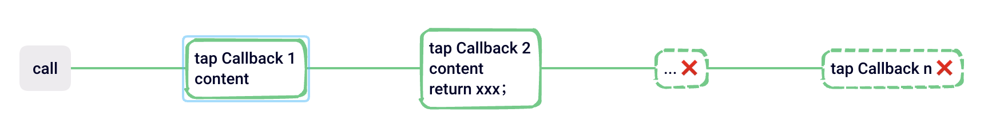
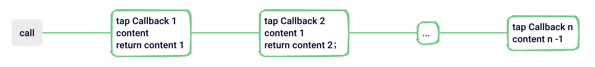
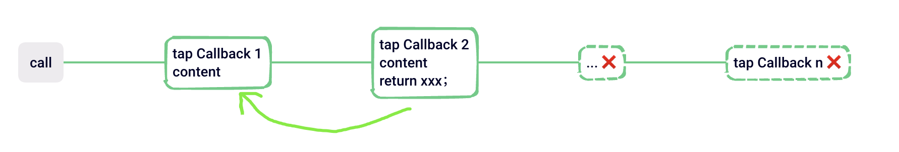
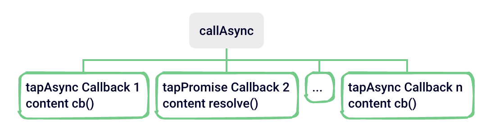
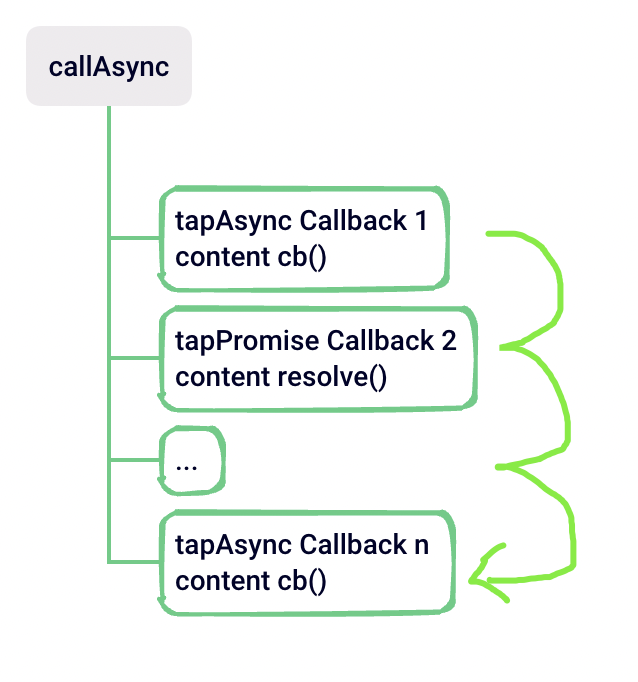
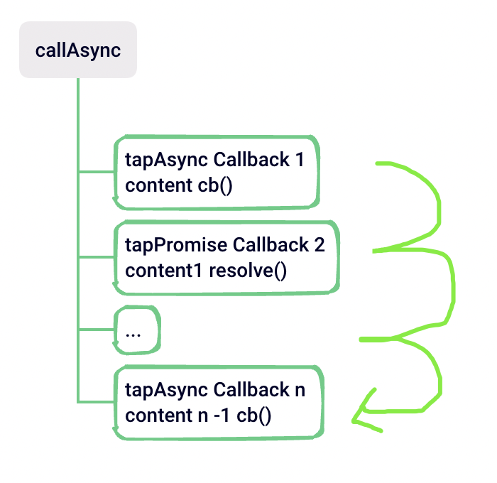

# tapable

-   一个类 EventEmit 库
-   它能够按照一定规则去触发订阅的事件

## 同步钩子

-   SyncHook

::: details

:::

-   SyncBailHook

::: details

:::

-   SyncWaterfallHook

::: details

:::

-   SyncLoopHook

::: details

:::

## 异步钩子

-   AsyncParallelHook

::: details

:::

-   AsyncSeriesHook

::: details

:::

-   AsyncSeriesWaterfallHook

::: details

:::
